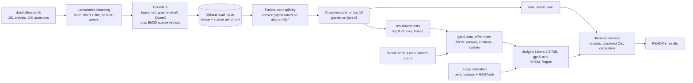

# rag-support-assistant

Retrieval-augmented answers for a fictional neobank's help center, measured the way a support team would need: which retrieval setup finds the right article, how often the assistant declines when it should, and how often it states something its sources do not support.
Results come with 95% confidence intervals and sample sizes, retrieval runs fully offline on CPU, and the model-graded parts are validated against labels known by construction instead of hand labels.

## Results

<!-- results:start -->
> Rows marked "pending live run" need Azure model calls, which have not been made yet. Every number shown was produced offline by `make demo` from committed results.

**Retrieval, test split** (130 questions with a gold article, article-level, no LLM). Mean with a 95% percentile bootstrap CI over clusters (questions grouped by their first gold article). Latency is per query on CPU, on a 4-vCPU container shared with other jobs, so it is rough (see Limitations).

| Config | Role | nDCG@10 | MRR@10 | Recall@5 | Recall@10 | p50 / p95 ms |
|---|---|---|---|---|---|---|
| fixed / bge-small | grid | 0.766 (0.727 to 0.807) | 0.817 (0.767 to 0.863) | 0.738 (0.671 to 0.809) | 0.870 (0.832 to 0.911) | 71 / 296 |
| fixed-title / bge-small | grid, chosen on dev | 0.782 (0.744 to 0.822) | 0.825 (0.776 to 0.872) | 0.779 (0.720 to 0.843) | 0.872 (0.834 to 0.912) | 49 / 96 |
| header / bge-small | grid | 0.797 (0.762 to 0.834) | 0.871 (0.827 to 0.913) | 0.784 (0.724 to 0.850) | 0.868 (0.830 to 0.909) | 103 / 1118 |
| fixed-title / granite-small | grid | 0.763 (0.719 to 0.809) | 0.826 (0.773 to 0.876) | 0.758 (0.697 to 0.824) | 0.834 (0.791 to 0.879) | 100 / 842 |
| fixed-title / bm25 | grid | 0.732 (0.673 to 0.789) | 0.792 (0.731 to 0.849) | 0.708 (0.635 to 0.783) | 0.820 (0.759 to 0.883) | 6 / 10 |
| fixed-title / bge-small+bm25 convex(a=0.7) | grid, chosen on dev, generation | 0.811 (0.771 to 0.853) | 0.864 (0.817 to 0.909) | 0.770 (0.710 to 0.836) | 0.887 (0.850 to 0.926) | 143 / 1325 |
| fixed-title / bge-small+bm25 rrf | grid, generation | 0.797 (0.753 to 0.842) | 0.850 (0.798 to 0.898) | 0.783 (0.721 to 0.848) | 0.882 (0.839 to 0.927) | 83 / 1347 |
| fixed-title / bge-small+bm25 convex(a=0.7) / rerank granite-rerank | grid, generation | 0.804 (0.763 to 0.849) | 0.856 (0.808 to 0.901) | 0.789 (0.726 to 0.854) | 0.887 (0.850 to 0.926) | 3215 / 5747 |
| fixed-title / qwen3-emb | strong arm (offline only) | 0.788 (0.749 to 0.829) | 0.832 (0.786 to 0.877) | 0.788 (0.729 to 0.853) | 0.883 (0.845 to 0.924) | 359 / 1834 |
| fixed-title / bge-small+bm25 convex(a=0.7) / rerank qwen3-rerank | strong arm (offline only) | 0.824 (0.782 to 0.868) | 0.870 (0.828 to 0.913) | 0.802 (0.743 to 0.863) | 0.887 (0.850 to 0.926) | 6025 / 16631 |

82 clusters. "chosen on dev" marks the winner of each step on dev nDCG@10, "generation" the three configs picked on dev for the answer runs.

**Paired comparisons on test**, same questions, clustered paired t-test (harness `compare_runs`), with the minimum detectable effect at 80% power.

| Step | Baseline -> candidate | nDCG@10 change (95% CI) | p | MDE | Recall@5 change (95% CI) | p |
|---|---|---|---|---|---|---|
| chunking | fixed / bge-small -> fixed-title / bge-small | +0.016 (-0.011 to +0.043) | 0.239 | 0.039 | +0.041 (+0.003 to +0.078) | 0.033 |
| chunking | fixed / bge-small -> header / bge-small | +0.031 (-0.004 to +0.066) | 0.081 | 0.049 | +0.046 (-0.001 to +0.093) | 0.055 |
| embedding | fixed-title / bge-small -> fixed-title / granite-small | -0.019 (-0.055 to +0.018) | 0.307 | 0.052 | -0.021 (-0.061 to +0.019) | 0.305 |
| first stage | fixed-title / bge-small -> fixed-title / bm25 | -0.050 (-0.103 to +0.003) | 0.063 | 0.076 | -0.071 (-0.128 to -0.015) | 0.014 |
| first stage | fixed-title / bge-small -> fixed-title / bge-small+bm25 convex(a=0.7) | +0.029 (+0.010 to +0.048) | 0.004 | 0.027 | -0.009 (-0.041 to +0.023) | 0.596 |
| first stage | fixed-title / bge-small -> fixed-title / bge-small+bm25 rrf | +0.015 (-0.016 to +0.047) | 0.325 | 0.044 | +0.004 (-0.036 to +0.044) | 0.838 |
| reranker | fixed-title / bge-small+bm25 convex(a=0.7) -> fixed-title / bge-small+bm25 convex(a=0.7) / rerank granite-rerank | -0.007 (-0.037 to +0.024) | 0.677 | 0.044 | +0.019 (-0.012 to +0.050) | 0.235 |
| strong arm | fixed-title / bge-small -> fixed-title / qwen3-emb | +0.006 (-0.031 to +0.043) | 0.754 | 0.052 | +0.009 (-0.032 to +0.050) | 0.660 |
| strong arm | fixed-title / bge-small+bm25 convex(a=0.7) -> fixed-title / bge-small+bm25 convex(a=0.7) / rerank qwen3-rerank | +0.013 (-0.012 to +0.038) | 0.316 | 0.036 | +0.031 (-0.002 to +0.065) | 0.068 |

**How the path was chosen (dev split, mean nDCG@10).** Test was run once, after these choices were fixed.

| Step | Candidates (dev nDCG@10) | Chosen |
|---|---|---|
| chunking | fixed / bge-small 0.747, fixed-title / bge-small 0.791, header / bge-small 0.779 | fixed-title / bge-small |
| embedding | fixed-title / bge-small 0.791, fixed-title / granite-small 0.749 | fixed-title / bge-small |
| first stage | fixed-title / bge-small 0.791, fixed-title / bm25 0.738, fixed-title / bge-small+bm25 convex(a=0.7) 0.839, fixed-title / bge-small+bm25 rrf 0.804 | fixed-title / bge-small+bm25 convex(a=0.7) |
| reranker | fixed-title / bge-small+bm25 convex(a=0.7) 0.839, fixed-title / bge-small+bm25 convex(a=0.7) / rerank granite-rerank 0.820 | fixed-title / bge-small+bm25 convex(a=0.7) |

Convex fusion weight on dense (alpha) swept on dev: 0.0: 0.736, 0.1: 0.758, 0.2: 0.772, 0.3: 0.792, 0.4: 0.813, 0.5: 0.828, 0.6: 0.825, 0.7: 0.839, 0.8: 0.811, 0.9: 0.795, 1.0: 0.791.


**Answers, test split** (150 questions: 120 answerable, 20 that should be declined, 10 false premises). gpt-6-luna, reasoning effort none, top 8 chunks. Judge: Llama-3.3-70B-Instruct. Clustered Wilson 95% CIs.

| Arm | Accuracy (answerable) | False refusal | Answered unanswerable | Hallucination rate | Premise corrected | $ per 1k answers | p50 ms |
|---|---|---|---|---|---|---|---|
| fixed-title / bge-small+bm25 convex(a=0.7) | pending live run | pending live run | pending live run | pending live run | pending live run | pending live run | pending live run |
| fixed-title / bge-small+bm25 convex(a=0.7) / rerank granite-rerank | pending live run | pending live run | pending live run | pending live run | pending live run | pending live run | pending live run |
| fixed-title / bge-small+bm25 rrf | pending live run | pending live run | pending live run | pending live run | pending live run | pending live run | pending live run |
| Full context (no retrieval) | pending live run | pending live run | pending live run | pending live run | pending live run | pending live run | pending live run |

**Abstention table, test split** (answered / abstained). The first two rows are the 2x2. False-premise questions count as unanswerable in the dataset, but the right move is to answer and correct the premise, so they get their own row.

| Expected | fixed-title / bge-small+bm25 convex(a=0.7) | fixed-title / bge-small+bm25 convex(a=0.7) / rerank granite-rerank | fixed-title / bge-small+bm25 rrf | Full context (no retrieval) |
|---|---|---|---|---|
| Answerable (120) | pending live run | pending live run | pending live run | pending live run |
| Should decline (20) | pending live run | pending live run | pending live run | pending live run |
| False premise (10) | pending live run | pending live run | pending live run | pending live run |

**Hallucination rate corrected for judge error, and judge agreement on the answers.** The correction is Rogan-Gladen with the Llama judge's TPR and TNR on the perturbation test split, and its interval carries their uncertainty. It assumes the judge errs on real answers the way it errs on synthetic ones. The RAGTruth rows below check that. Kappa compares the Llama and gpt-5-mini `grounded` verdicts on the same answers.

| Arm | Judged hallucination rate | Corrected (95% CI) | Llama vs gpt-5-mini kappa | n |
|---|---|---|---|---|
| fixed-title / bge-small+bm25 convex(a=0.7) | pending live run | pending live run | pending live run | |
| fixed-title / bge-small+bm25 convex(a=0.7) / rerank granite-rerank | pending live run | pending live run | pending live run | |
| fixed-title / bge-small+bm25 rrf | pending live run | pending live run | pending live run | |
| Full context (no retrieval) | pending live run | pending live run | pending live run | |


**Judge validation without human labels.** Perturbation test split: 462 items built from the facts file (240 faithful, 222 with one injected error), labels known by construction. The judge prompt is tuned on the 160 dev items only and frozen, by fingerprint, before test is judged. RAGTruth: 200 human-annotated QA responses (half with a hallucination). TPR is the share of good answers passed, TNR the share of flawed answers caught. Wilson 95% CIs, kappa with a bootstrap CI.

| Judge | Set | Check | n | TPR | TNR | Cohen's kappa |
|---|---|---|---|---|---|---|
| Llama-3.3-70B-Instruct | perturbations | grounded | pending live run | | | |
| Llama-3.3-70B-Instruct | perturbations | correct | pending live run | | | |
| Llama-3.3-70B-Instruct | RAGTruth | grounded | pending live run | | | |
| gpt-5-mini | perturbations | grounded | pending live run | | | |
| gpt-5-mini | perturbations | correct | pending live run | | | |
| gpt-5-mini | RAGTruth | grounded | pending live run | | | |
| HHEM-2.1-Open (threshold 0.5) | perturbations | grounded | 462 | 89.6% (85.1% to 92.8%) | 68.9% (62.6% to 74.6%) | 0.59 (0.52 to 0.66) |
| HHEM-2.1-Open (threshold 0.5) | RAGTruth | grounded | 200 | 96.0% (90.2% to 98.4%) | 53.0% (43.3% to 62.5%) | 0.49 (0.38 to 0.60) |

**Flagged as not grounded, by perturbation type (test).** For the four error types this is the catch rate, for original and paraphrase the false alarm rate.

| Judge | original (n=120) | paraphrase (n=120) | wrong_number (n=68) | wrong_plan (n=22) | superseded (n=12) | unsupported_claim (n=120) |
|---|---|---|---|---|---|---|
| Llama-3.3-70B-Instruct | pending live run | pending live run | pending live run | pending live run | pending live run | pending live run |
| gpt-5-mini | pending live run | pending live run | pending live run | pending live run | pending live run | pending live run |
| HHEM-2.1-Open | 0.0% (0.0% to 3.1%) | 20.8% (14.5% to 28.9%) | 57.4% (45.5% to 68.4%) | 0.0% (0.0% to 14.9%) | 16.7% (4.7% to 44.8%) | 93.3% (87.4% to 96.6%) |


**Live-only cells.**

- Contextual retrieval (one cell, LLM-written context per chunk): pending live run.
- Ragas 0.4.3 faithfulness and context recall on two configs: pending live run.
<!-- results:end -->

## Quickstart

```bash
git clone https://github.com/rkemery/rag-support-assistant.git
cd rag-support-assistant
uv run make demo
```

`make demo` needs no keys and no network after `uv sync`. It checks every committed dataset against its hashes and rebuilds the results section above from the committed result files. `make test` runs the test suite (no downloads, no keys) and `make lint` runs ruff.

To rerun the retrieval grid: `make retrieval`. It downloads the open models and took 43 CPU minutes (39 minutes wall) on a shared 4-vCPU container, most of it in the two rerankers. For the live model runs, see [Cost of a full live run](#cost-of-a-full-live-run).

## What's inside

| Path | What it is |
|---|---|
| `data/tallowbrook/` | Pinned copy of the synthetic Tallowbrook corpus (151 articles), facts file and RAG questions (50 dev, 150 test, 40 unanswerable), with a sha256 manifest. `scripts/sync_data.py` verifies it. |
| `data/judge_validation/` | 622 perturbed answers built by code from the facts file, labels in the harness label format, and the dev/test split. |
| `data/ragtruth/` | A seeded 200-response subset of RAGTruth QA (100 with a human-marked hallucination, 100 without), with its MIT license and source hashes. |
| `src/rag_support_assistant/` | `chunking` (LlamaIndex parsers), `bm25` (BM25 as Qdrant sparse vectors), `retrieval` (Qdrant local mode through LlamaIndex, explicit fusion, reranking), `grid` (dev selection, then test once), `scoring` (ranx), `generation`, `judging`, `perturb`, `ragtruth`, `hhem`, `contextual`, `ragas_adapter`, `clients` (the live client stack), `pipeline`, `analysis`, `readme`, `snapshot`, `cli`. |
| `results/` | Harness JSONL records, one per question per run: `retrieval/` (every config on dev and test, plus `selection.json` with the dev decisions and compute used), `contexts/` (the frozen top chunks each generation config sends), `hhem/` (HHEM on the validation sets, offline), and, after a live run, `generation/`, `judge/`, `contextual/`, `ragas/` and `live_runs.jsonl`. |
| `cache/` | Replay cache for model calls, keyed by the sha256 of each request. Empty until the first live run. |
| `snapshot/` | Frozen retrieval snapshot for the agents repo: chunks, bge-small embeddings, config and hashes. |

The `eval` command covers every step: `retrieval`, `contexts`, `build-validation`, `hhem`, `export-snapshot`, `estimate`, `demo` and `verify-data` run offline. `judge-dev`, `judge-freeze` and `run` make model calls with `--live`, or replay the cache with `--replay`.

## Architecture



Every live call goes through the same stack, outermost first: the harness `CachedClient` (committed disk cache, so a replay costs nothing), `RetryingClient`, `DollarCap` (refuses any call that could take spend past the cap), this repo's `RateLimitedClient` (keeps estimated tokens per minute under each deployment's quota) and the harness `FoundryClient`.

## What we measured and why

**Retrieval, at the article level.** Gold labels name articles, so each ranked chunk list is collapsed to articles by first appearance before scoring with ranx. nDCG@10 is the primary metric because a question can have several gold articles and position matters. MRR@10 says how soon the first right article shows up. Recall@5 and recall@10 say how much of the gold set reaches the answer model. Gold is inclusive by design (a fact stated in seven articles gives seven gold articles), which pulls recall down, so recall sits next to MRR rather than alone. Only the 130 test questions with a gold article are scored: answerable questions and false premises, whose gold is the article that refutes them.

**One factor at a time, chosen on dev.** Four steps: chunking (fixed 128-token chunks, the same with the article title, header-aware sections with the title), embedding model, first stage (dense, BM25 alone, hybrid with convex fusion, hybrid with RRF) and a reranker. Each step keeps the dev winner by nDCG@10. The convex weight is swept on dev. Test runs once, after every choice is fixed. The Qwen3 strong-arm rows ride on the chosen path and never change it.

**Error bars that respect correlated questions.** Questions that cite the same leading article share source material, so they are clustered by their first gold article. Means get a percentile bootstrap over clusters, and paired comparisons use the harness's clustered paired t-test with a minimum detectable effect, so "no difference" reads as "too small to see at this n".

**Answers.** The three retrieval configs with the best dev nDCG@10 feed gpt-6-luna the top 8 chunks, and a full-context arm puts the whole corpus in the prompt instead. The answer is structured output with citations and an explicit abstain flag, so abstention is measured by code, not by a judge. The metrics: accuracy on answerable questions (abstaining counts as wrong), the abstention 2x2 table, false refusal rate, the share of should-decline questions answered, premise correction on the 10 false-premise questions, hallucination rate (answers with at least one claim the reference answer and the current source articles do not support), cost per 1,000 answers and latency.

**Judges, checked against known labels.** Llama 3.3 70B (a different model family from the answer model) grades every answer with two binary checks, `correct` and `grounded`. gpt-5-mini grades the same answers as a second judge, which doubles as the same-vendor versus cross-family comparison. Both are scored against labels known by construction and against RAGTruth's human annotations before their verdicts on real answers are reported. The hallucination rate is also shown corrected for the primary judge's measured error rates.

## Design decisions

- **BM25 inside Qdrant.** Each chunk's BM25 term weights, IDF included, are stored as a Qdrant sparse vector and a query vector holds term counts, so Qdrant's sparse dot product is the BM25 score (Robertson and Zaragoza, "The Probabilistic Relevance Framework: BM25 and Beyond", 2009, k1 = 1.2, b = 0.75). Dense, BM25 and hybrid search then share one local collection, and a test checks Qdrant's scores against the formula.
- **Fusion set explicitly, both kinds tested.** LlamaIndex's Qdrant store takes the fusion function as an argument, and the grid always passes one. Convex fusion is a weighted sum of min-max normalized scores with its weight tuned on dev, which Bruch, Gai and Ingber found beats RRF when a few labeled queries are available ([arXiv 2210.11934](https://arxiv.org/abs/2210.11934)). RRF is rank-only with k = 60 (Cormack, Clarke and Buettcher, SIGIR 2009).
- **Rerank only the top 10 chunks.** A cross-encoder reads the query and passage together, which is more accurate and much slower than comparing embeddings, so it rescores only the first-stage head, as the plan fixed. Chunks below 10 keep their order.
- **Titles in the embedding text.** A short section like "## Good to know" means little without its article's title, so two of the three chunkers prepend it through LlamaIndex metadata, and the dense and BM25 encoders see the same string. The contextual-retrieval cell does the same with a model-written context instead of a title (Anthropic, "Introducing Contextual Retrieval", 2024, whose prompt is used verbatim).
- **Frozen contexts.** The top chunks each generation config sends are written to `results/contexts/` offline. Live and replayed answer calls read them, so a replay sends byte-identical requests and never depends on a model download or on float rounding.
- **Abstain as a field, false premises as answers.** The JSON schema has an `abstain` boolean, so the 2x2 table needs no judge. The dataset marks false-premise questions unanswerable, but the right reply corrects the premise, so they get their own row instead of being counted as missed refusals.
- **Full context as a cached prefix.** The whole corpus goes first as an identical developer message and the question last, so the provider's prompt cache can serve the prefix after the first call.
- **Binary, reference-guided checks.** The judge is the harness `ChecklistJudge`: yes/no checks instead of a 1 to 5 scale (CheckEval, [arXiv 2403.18771](https://arxiv.org/abs/2403.18771)) and the reference answer in the prompt (Zheng et al., [arXiv 2306.05685](https://arxiv.org/abs/2306.05685)). This repo supplies its own template, which adds the source articles and marks superseded ones.
- **Judge validation without human labels.** The perturbation set takes every answerable question's reference answer and makes a faithful paraphrase plus copies with exactly one injected error: a number that appears nowhere in the facts file, another plan's value for the same fact, a superseded policy's value, or one fabricated sentence whose key phrase is checked to be absent from the corpus. Labels follow from construction. The judge prompt is tuned on the 160 dev items and frozen (its fingerprint is stored, and test-set judging refuses a changed judge) before the 462 test items are scored. RAGTruth (Niu et al., ACL 2024, [arXiv 2401.00396](https://arxiv.org/abs/2401.00396)) adds natural errors written by real models and marked by people.
- **Corrected hallucination rate.** A judge with known TPR and TNR over- or under-counts in a predictable way, so the rate is also shown after a Rogan-Gladen correction, with an interval that carries the uncertainty in TPR and TNR (Lee et al., [arXiv 2511.21140](https://arxiv.org/abs/2511.21140), implemented in the harness).
- **Clustered error bars.** Miller ("Adding Error Bars to Evals", [arXiv 2411.00640](https://arxiv.org/abs/2411.00640)) recommends clustered standard errors when items share a source, which is the case here.
- **Two second opinions that are not the judge.** HHEM-2.1-Open, a small classifier, scores the same premise and answer pairs as the LLM judge. Ragas 0.4.3 (Es et al., [arXiv 2309.15217](https://arxiv.org/abs/2309.15217)) runs faithfulness and context recall on two configs, with its LLM calls routed through the same capped, cached client as everything else.
- **A rate limiter in front of the cap.** `DollarCap` charges a failed call its worst case, so a burst of 429s would eat the budget without spending it. The limiter keeps estimated tokens per minute (prompt plus `max_output_tokens`, which Azure counts on arrival) under 80% of each deployment's quota.

## What didn't work

- **The reranker.** On dev the granite cross-encoder on the top 10 chunks lowered nDCG@10 (0.839 to 0.820), so the grid dropped it. On test it moved nDCG@10 by -0.007 (-0.037 to +0.024) and added about 3 seconds per query on this CPU. The 0.6B Qwen3 reranker did a little better on test (+0.013, CI includes 0) at about 6 seconds per query. Every chunk already carries its article title, and the hybrid first stage ranks well on these short articles, which leaves a reranker little to fix.
- **granite-small in place of bge-small.** It lost on dev (0.749 against 0.791) and on test (-0.019, not significant), even though it is the newer model.
- **Header-aware chunks.** They lost to fixed chunks with the title on dev (0.779 against 0.791) and beat them on test (0.797 against 0.782), with neither gap significant. The dev choice stands. The clearer result is the title itself: adding it to fixed chunks raised test recall@5 by 4.1 points (p = 0.033).
- **RRF.** It trailed convex fusion on dev (0.804 against 0.839) and on test (0.797 against 0.811). Only convex fusion beat dense retrieval significantly on test (+0.029 nDCG@10, p = 0.004). Rank fusion discards how far apart the scores are, which is exactly what the tuned weight uses.
- **BM25 alone.** Lowest nDCG@10 of the grid on both splits, though at 6 ms per query it is by far the cheapest.
- **HHEM as a check on numbers.** On the perturbation test split it caught 93% of appended claims but none of the 22 answers carrying another plan's value and 2 of the 12 carrying a superseded value, and it flagged 21% of faithful paraphrases. The premise often includes the all-plans fee table, and HHEM appears not to check which plan a number belongs to. On RAGTruth it caught 53% of the human-marked hallucinations. It stays a second opinion next to the LLM judge, not a replacement.
- **HHEM's own loading code.** Its `trust_remote_code` class fails under transformers 5 (it never calls `post_init`). Rebuilding the same computation from transformers' `T5ForTokenClassification` reproduces the scores printed on the model card to four decimals, and runs no remote code.
- **Ragas 0.4.3 with current LangChain.** It imports `langchain_community.chat_models.vertexai`, which langchain-community 0.4.2 removed. The `ragas` extra pins langchain-community 0.4.1, the release that was current when Ragas 0.4.3 shipped.
- **Four torch threads on a shared 4-vCPU box.** With other jobs running, a single bge-small query took 0.8 to 2 seconds instead of about 30 ms, because OpenMP threads spin while they wait for cores. Torch is pinned to 2 threads, and the grid was rerun from scratch.
- **Smaller snags.** LlamaIndex's bundled NLTK stopword file is refused by NLTK's hardlink check when uv installs it, so the list is inlined. A literal "$5.00" in the judge prompt broke Python's `string.Template`, which reads `$5` as a placeholder. A unit test caught it before any live call. Few reference answers state a versioned number, so superseded-value perturbations came to 15 items, and word-level swaps (travel notices, the old lost-card phone line) only brought them to 17.

## Limitations

- **No human labels.** Every judge-scored number is "judge-scored, judge validated on synthetic perturbations and RAGTruth". Synthetic errors (a swapped number, an appended sentence) are easier to catch than the errors models make, so the perturbation TNR is an upper bound on what the judge catches in real answers. RAGTruth is the check on natural errors, but its passages and questions come from MS MARCO, not from a bank.
- **Synthetic, templated corpus.** One model wrote the articles and questions, per-plan variants share templates, and the gold labels have not been audited by a person. Real help centers are messier, so absolute scores here will be higher than on real data.
- **Small test set.** 130 scored retrieval questions and 150 answer questions. Differences of a few points are below the MDE the tables print.
- **Latency is rough.** It was measured on a 4-vCPU container shared with other training jobs, with torch pinned to 2 threads. The same config ran at a p50 of 48 ms on dev and 143 ms on test because the load changed. Use it to rank configs by order of magnitude, not to quote.
- **The perturbation types are narrow.** They cover wrong values, wrong plans, superseded values and appended claims. They do not cover omissions, wrong reasoning or a wrong answer built from true facts. Only 12 test items carry a superseded value, because few reference answers state a versioned number.
- **HHEM's premise includes the reference answer.** That matches what the LLM judge sees, but an answer copied from the reference is trivially consistent. Its threshold is fixed at 0.5 and not tuned.
- **Long-context pricing and quota are unconfirmed.** Day 1 left open whether a prompt of this size falls in a higher price band for gpt-6-luna, and the estimate below uses the standard rate. The full-context prompt is about 37K tokens (cl100k count), larger than luna's default 20K tokens-per-minute quota, so Azure may refuse it outright until luna's capacity is raised (set `RAG_TPM` to match).
- **A live run is slow at the default quotas.** Azure counts `max_output_tokens` against tokens per minute, and the Llama judge has 10K. The cost table below includes the least wall time each stage needs at those quotas. Raising capacity and setting `RAG_TPM` shortens it in proportion.
- **RAGTruth is graded with this repo's judge prompt,** which frames the task as a Tallowbrook help-center answer. That keeps one frozen judge for both checks, but it is a transfer test in more than one way.
- **Dev and test disagree on small differences.** Header-aware chunking lost on dev and won on test. With about 40 dev questions, a step decided by 0.01 nDCG@10 is close to a coin flip, which is why the paired test results carry more weight than the path.
- **Replay depends on request bytes.** The cache key is the request, so changing a prompt, the context size or a model setting turns a replay into cache misses. That is on purpose.

## Cost of a full live run

<!-- cost:start -->
Estimated before any live call by `eval estimate`, which builds the requests the run will send and prices them at list prices. "Expected" assumes about 4 bytes per token, typical output lengths and the full-context prefix served from the prompt cache after the first call. "Worst case" is what `DollarCap` reserves per call (one token per input byte plus `max_output_tokens`), the bound it enforces. Answer judging uses the reference answer as a stand-in answer, since real answers do not exist yet.

| Stage | Calls | Expected $ | DollarCap worst case $ | Minutes at default quota |
|---|---|---|---|---|
| judge perturbations dev (llama) | 160 | 0.191 | 0.745 | 42 |
| judge perturbations dev (gpt5mini) | 160 | 0.175 | 0.442 | 24 |
| judge perturbations test (llama) | 462 | 0.525 | 2.042 | 115 |
| judge perturbations test (gpt5mini) | 462 | 0.494 | 1.239 | 66 |
| judge RAGTruth (llama) | 200 | 0.179 | 0.692 | 40 |
| judge RAGTruth (gpt5mini) | 200 | 0.197 | 0.469 | 24 |
| answers fixed-title-hybrid-bge-small-convex0.7 | 150 | 0.031 | 0.134 | 21 |
| answers fixed-title-hybrid-bge-small-convex0.7-granite-rerank | 150 | 0.031 | 0.133 | 21 |
| answers fixed-title-hybrid-bge-small-rrf | 150 | 0.032 | 0.136 | 22 |
| answers full-context | 150 | 0.093 | 2.499 | 150 |
| judge answers, 4 arms (llama) | 600 | 0.607 | 2.352 | 134 |
| judge answers, 4 arms (gpt5mini) | 600 | 0.616 | 1.503 | 78 |
| contextual retrieval contexts | 367 | 0.029 | 0.098 | 16 |
| Ragas (2 configs, luna) | 900 | 0.270 | 1.170 | n/a |
| Total | 4711 | 3.47 | 13.65 | 754 |

"Minutes at default quota" is the least wall time the rate limiter allows at the day-1 capacities (gpt-6-luna 20K, gpt-5-mini 20K, Llama-3.3-70B-Instruct 10K tokens per minute), using 80% of each. Stages run one after another, so the whole run needs about 13 hours unless capacities are raised and `RAG_TPM` is set to match. The full-context prompt is larger than luna's whole default quota, so that stage needs a raised luna capacity to run at all.

`make eval-live` runs with a hard cap of $8.00 (`make eval-live CAP=...` to change it), a bit more than twice the expected spend. A refused call stops the run, and cached calls cost nothing when it is started again.

Actual spend: pending live run.
<!-- cost:end -->

## How I built this

The code was written with Claude Code as a pair programmer, under my direction and review. The plan, the metrics and the ground rules (tune on dev, report test once, no invented numbers, no human labels passed off as validation) come from my build plan.

## License

MIT. Copyright (c) 2026 Richard Kemery. The vendored Tallowbrook data is CC-BY-4.0 and the RAGTruth subset is MIT, see [DATA_SOURCES.md](DATA_SOURCES.md).
