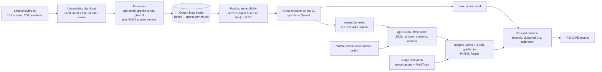

# rag-support-assistant

Retrieval-augmented answers for a fictional neobank's help center, scored on retrieval, abstention and hallucination with 95% CIs and no hand-written labels.

- **Full context ties the best retrieval arm** (119 vs 117 of 120, p = 0.5) at 2.6x the cost warm and about 22x cold, and only fits a 37K-token corpus.
- **The judges miss real errors.** They catch 100% of synthetic errors but only 59% (Llama) and 64% (gpt-5-mini) of RAGTruth's hallucinations, so the hallucination rates below carry an unknown miss rate.
- **Convex hybrid fusion is the only significant retrieval gain.** +0.029 nDCG@10 over dense retrieval on 130 test questions (p = 0.004).

## Quickstart

```bash
git clone https://github.com/rkemery/rag-support-assistant.git
cd rag-support-assistant
uv run make demo
```

No keys or network after `uv sync`. Rebuilds Results and Cost from committed files. Live runs: see [Cost](#cost).

## Results

<!-- results:start -->
> Every number shown was produced offline by `make demo` from committed results, including the replies of the live model runs.

**Retrieval, test split** (130 questions with a gold article, article-level, no LLM). Mean with a 95% percentile bootstrap CI over clusters (questions grouped by their first gold article). Latency per query on CPU is rough (see Limitations).

| Config | Role | nDCG@10 | MRR@10 | Recall@5 | Recall@10 | p50 / p95 ms |
|---|---|---|---|---|---|---|
| fixed-title / bge-small | grid, chosen on dev | 0.782 (0.744 to 0.822) | 0.825 (0.776 to 0.872) | 0.779 (0.720 to 0.843) | 0.872 (0.834 to 0.912) | 49 / 96 |
| fixed-title / bge-small+bm25 convex(a=0.7) | grid, chosen on dev, generation | 0.811 (0.771 to 0.853) | 0.864 (0.817 to 0.909) | 0.770 (0.710 to 0.836) | 0.887 (0.850 to 0.926) | 143 / 1325 |
| fixed-title / bge-small+bm25 rrf | grid, generation | 0.797 (0.753 to 0.842) | 0.850 (0.798 to 0.898) | 0.783 (0.721 to 0.848) | 0.882 (0.839 to 0.927) | 83 / 1347 |
| fixed-title / bge-small+bm25 convex(a=0.7) / rerank granite-rerank | grid, generation | 0.804 (0.763 to 0.849) | 0.856 (0.808 to 0.901) | 0.789 (0.726 to 0.854) | 0.887 (0.850 to 0.926) | 3215 / 5747 |

82 clusters. "chosen on dev" marks the winner of each step on dev nDCG@10, "generation" the three configs picked on dev for the answer runs.

<details>
<summary><b>All retrieval configs</b></summary>

| Config | Role | nDCG@10 | MRR@10 | Recall@5 | Recall@10 | p50 / p95 ms |
|---|---|---|---|---|---|---|
| fixed / bge-small | grid | 0.766 (0.727 to 0.807) | 0.817 (0.767 to 0.863) | 0.738 (0.671 to 0.809) | 0.870 (0.832 to 0.911) | 71 / 296 |
| fixed-title / bge-small | grid, chosen on dev | 0.782 (0.744 to 0.822) | 0.825 (0.776 to 0.872) | 0.779 (0.720 to 0.843) | 0.872 (0.834 to 0.912) | 49 / 96 |
| header / bge-small | grid | 0.797 (0.762 to 0.834) | 0.871 (0.827 to 0.913) | 0.784 (0.724 to 0.850) | 0.868 (0.830 to 0.909) | 103 / 1118 |
| fixed-title / granite-small | grid | 0.763 (0.719 to 0.809) | 0.826 (0.773 to 0.876) | 0.758 (0.697 to 0.824) | 0.834 (0.791 to 0.879) | 100 / 842 |
| fixed-title / bm25 | grid | 0.732 (0.673 to 0.789) | 0.792 (0.731 to 0.849) | 0.708 (0.635 to 0.783) | 0.820 (0.759 to 0.883) | 6 / 10 |
| fixed-title / bge-small+bm25 convex(a=0.7) | grid, chosen on dev, generation | 0.811 (0.771 to 0.853) | 0.864 (0.817 to 0.909) | 0.770 (0.710 to 0.836) | 0.887 (0.850 to 0.926) | 143 / 1325 |
| fixed-title / bge-small+bm25 rrf | grid, generation | 0.797 (0.753 to 0.842) | 0.850 (0.798 to 0.898) | 0.783 (0.721 to 0.848) | 0.882 (0.839 to 0.927) | 83 / 1347 |
| fixed-title / bge-small+bm25 convex(a=0.7) / rerank granite-rerank | grid, generation | 0.804 (0.763 to 0.849) | 0.856 (0.808 to 0.901) | 0.789 (0.726 to 0.854) | 0.887 (0.850 to 0.926) | 3215 / 5747 |
| fixed-title / qwen3-emb | strong arm (offline only) | 0.788 (0.749 to 0.829) | 0.832 (0.786 to 0.877) | 0.788 (0.729 to 0.853) | 0.883 (0.845 to 0.924) | 359 / 1834 |
| fixed-title / bge-small+bm25 convex(a=0.7) / rerank qwen3-rerank | strong arm (offline only) | 0.824 (0.782 to 0.868) | 0.870 (0.828 to 0.913) | 0.802 (0.743 to 0.863) | 0.887 (0.850 to 0.926) | 6025 / 16631 |

</details>

<details>
<summary><b>Paired comparisons on test</b></summary>

Clustered paired t-test on the same questions (harness `compare_runs`), with the minimum detectable effect (MDE) at 80% power. Each step's candidates were fixed on dev before test ran, so the nDCG@10 tests on the grid rows are confirmatory. The recall@5 columns and the strong-arm rows are exploratory.

| Step | Baseline -> candidate | nDCG@10 change (95% CI) | p | MDE | Recall@5 change (95% CI) | p |
|---|---|---|---|---|---|---|
| chunking | fixed / bge-small -> fixed-title / bge-small | +0.016 (-0.011 to +0.043) | 0.239 | 0.039 | +0.041 (+0.003 to +0.078) | 0.033 |
| chunking | fixed / bge-small -> header / bge-small | +0.031 (-0.004 to +0.066) | 0.081 | 0.049 | +0.046 (-0.001 to +0.093) | 0.055 |
| embedding | fixed-title / bge-small -> fixed-title / granite-small | -0.019 (-0.055 to +0.018) | 0.307 | 0.052 | -0.021 (-0.061 to +0.019) | 0.305 |
| first stage | fixed-title / bge-small -> fixed-title / bm25 | -0.050 (-0.103 to +0.003) | 0.063 | 0.076 | -0.071 (-0.128 to -0.015) | 0.014 |
| first stage | fixed-title / bge-small -> fixed-title / bge-small+bm25 convex(a=0.7) | +0.029 (+0.010 to +0.048) | 0.004 | 0.027 | -0.009 (-0.041 to +0.023) | 0.596 |
| first stage | fixed-title / bge-small -> fixed-title / bge-small+bm25 rrf | +0.015 (-0.016 to +0.047) | 0.325 | 0.044 | +0.004 (-0.036 to +0.044) | 0.838 |
| reranker | fixed-title / bge-small+bm25 convex(a=0.7) -> fixed-title / bge-small+bm25 convex(a=0.7) / rerank granite-rerank | -0.007 (-0.037 to +0.024) | 0.677 | 0.044 | +0.019 (-0.012 to +0.050) | 0.235 |
| strong arm | fixed-title / bge-small -> fixed-title / qwen3-emb | +0.006 (-0.031 to +0.043) | 0.754 | 0.052 | +0.009 (-0.032 to +0.050) | 0.660 |
| strong arm | fixed-title / bge-small+bm25 convex(a=0.7) -> fixed-title / bge-small+bm25 convex(a=0.7) / rerank qwen3-rerank | +0.013 (-0.012 to +0.038) | 0.316 | 0.036 | +0.031 (-0.002 to +0.065) | 0.068 |

</details>

<details>
<summary><b>How the path was chosen</b> (dev split, mean nDCG@10)</summary>

Test was run once, after these choices were fixed.

| Step | Candidates (dev nDCG@10) | Chosen |
|---|---|---|
| chunking | fixed / bge-small 0.747, fixed-title / bge-small 0.791, header / bge-small 0.779 | fixed-title / bge-small |
| embedding | fixed-title / bge-small 0.791, fixed-title / granite-small 0.749 | fixed-title / bge-small |
| first stage | fixed-title / bge-small 0.791, fixed-title / bm25 0.738, fixed-title / bge-small+bm25 convex(a=0.7) 0.839, fixed-title / bge-small+bm25 rrf 0.804 | fixed-title / bge-small+bm25 convex(a=0.7) |
| reranker | fixed-title / bge-small+bm25 convex(a=0.7) 0.839, fixed-title / bge-small+bm25 convex(a=0.7) / rerank granite-rerank 0.820 | fixed-title / bge-small+bm25 convex(a=0.7) |

Convex fusion weight on dense (alpha) swept on dev: 0.0: 0.736, 0.1: 0.758, 0.2: 0.772, 0.3: 0.792, 0.4: 0.813, 0.5: 0.828, 0.6: 0.825, 0.7: 0.839, 0.8: 0.811, 0.9: 0.795, 1.0: 0.791.

</details>

**Answers, test split** (150 questions: 120 answerable, 20 that should be declined, 10 false premises). gpt-6-luna, reasoning effort none, top 8 chunks. Judge: Llama-3.3-70B-Instruct. Clustered Wilson 95% CIs.

| Arm | Accuracy (answerable) | False refusal | Answered unanswerable | Hallucination rate | Premise corrected | $ per 1k answers | p50 ms |
|---|---|---|---|---|---|---|---|
| fixed-title / bge-small+bm25 convex(a=0.7) | 97.5% (92.8% to 99.2%), n=120 | 0.8% (0.1% to 4.7%), n=120 | 40.0% (21.0% to 62.6%), n=20 | 0.7% (0.1% to 4.1%), n=137 | 100.0% (65.3% to 100.0%), n=10 | 0.163 | 1597 |
| fixed-title / bge-small+bm25 convex(a=0.7) / rerank granite-rerank | 94.2% (88.3% to 97.2%), n=120 | 1.7% (0.5% to 6.0%), n=120 | 50.0% (28.8% to 71.2%), n=20 | 1.4% (0.4% to 5.3%), n=138 | 100.0% (65.3% to 100.0%), n=10 | 0.163 | 4711 |
| fixed-title / bge-small+bm25 rrf | 94.1% (88.1% to 97.1%), n=118 | 0.8% (0.1% to 4.7%), n=120 | 40.0% (21.0% to 62.6%), n=20 | 2.2% (0.7% to 6.4%), n=135 | 100.0% (65.3% to 100.0%), n=10 | 0.167 | 1571 |
| Full context (no retrieval) | 99.2% (95.3% to 99.9%), n=120 | 0.0% (0.0% to 3.2%), n=120 | 15.0% (4.9% to 37.7%), n=20 | 0.0% (0.0% to 2.9%), n=133 | 100.0% (65.3% to 100.0%), n=10 | 0.420 | 2111 |

The hallucination rate counts answered questions only (answerable + should-decline + false premise), so its denominator differs by arm: 137 (119 + 8 + 10), 138 (118 + 10 + 10), 137 (119 + 8 + 10) and 133 (120 + 3 + 10), in table order. The table's n is smaller where the judge couldn't parse a reply (see below).

fixed-title / bge-small+bm25 rrf: Llama's reply couldn't be parsed for 2 answers (q-test-007, q-test-068), so they're left out of its accuracy and hallucination rate. The replies use bare `no` and `yes` instead of JSON booleans. Read as written, accuracy would be 111/120 = 92.5% and the hallucination rate 4/137 = 2.9% (see Limitations).

<details>
<summary><b>Abstention table, test split</b> (answered / abstained)</summary>

The first two rows are the 2x2. False-premise questions count as unanswerable in the dataset, but the right move is to answer and correct the premise, so they get their own row.

| Expected | fixed-title / bge-small+bm25 convex(a=0.7) | fixed-title / bge-small+bm25 convex(a=0.7) / rerank granite-rerank | fixed-title / bge-small+bm25 rrf | Full context (no retrieval) |
|---|---|---|---|---|
| Answerable (120) | 119 / 1 | 118 / 2 | 119 / 1 | 120 / 0 |
| Should decline (20) | 8 / 12 | 10 / 10 | 8 / 12 | 3 / 17 |
| False premise (10) | 10 / 0 | 10 / 0 | 10 / 0 | 10 / 0 |

The 20 should-decline questions are 10 near-miss and 10 out-of-scope, and the answered ones by type (near-miss / out-of-scope) are 7 / 1, 8 / 2, 7 / 1, 3 / 0, in table order. Near-miss reference answers are partial answers, while the answer prompt says to abstain when the excerpts lack the answer, and Llama passed all 29 answered replies as correct and grounded. So "answered unanswerable" mostly counts replies that say the help center lacks the detail without setting the abstain flag. The metric stays as defined before the run.

</details>

<details>
<summary><b>Hallucination flags on the answers, by judge</b> (flagged as not grounded / judged)</summary>

Disagree counts the answers both LLM judges read where their `grounded` verdicts differ.

| Arm | Llama | gpt-5-mini | Llama vs gpt-5-mini disagree | HHEM |
|---|---|---|---|---|
| fixed-title / bge-small+bm25 convex(a=0.7) | 1 / 137 | 4 / 137 | 3 / 137 | 17 / 137 |
| fixed-title / bge-small+bm25 convex(a=0.7) / rerank granite-rerank | 2 / 138 | 3 / 138 | 1 / 138 | 17 / 138 |
| fixed-title / bge-small+bm25 rrf | 3 / 135 | 5 / 137 | 0 / 135 | 18 / 137 |
| Full context (no retrieval) | 0 / 133 | 0 / 133 | 0 / 133 | 9 / 133 |

A Rogan-Gladen correction for judge error ran but can't be identified here: with the Llama judge's perturbation TPR and TNR both at 1.00 it returns every judged rate unchanged, and with RAGTruth's (TPR 93%, TNR 59%) it gives a negative rate for every arm (-13% to -9%), which clips to 0. The true hallucination rate is unknown, bracketed by a judge that catches 100% of synthetic errors and 59% of RAGTruth's.

The arms are at most 3 flagged answers apart by Llama and 5 by gpt-5-mini, and the two LLM judges rank the retrieval arms differently, so the arms can't be told apart on hallucination.

HHEM flags far more answers than either LLM judge, which fits its 21% false-alarm rate on faithful paraphrases.

</details>

<details>
<summary><b>Judge validation</b> (no labels written for this repo)</summary>

Perturbation test split: 462 items built from the facts file (240 faithful, 222 with one injected error), labels known by construction. The judge prompt is tuned on the 160 dev items only and frozen, by fingerprint, before test is judged. RAGTruth: 200 human-annotated QA responses (half with a hallucination). TPR is the share of good answers passed, TNR the share of flawed answers caught. Wilson 95% CIs, kappa with a bootstrap CI.

| Judge | Set | Check | n | TPR | TNR | Cohen's kappa |
|---|---|---|---|---|---|---|
| Llama-3.3-70B-Instruct | perturbations | grounded | 462 | 100.0% (98.4% to 100.0%) | 100.0% (98.3% to 100.0%) | 1.00 (1.00 to 1.00) |
| Llama-3.3-70B-Instruct | perturbations | correct | 342 | 100.0% (98.4% to 100.0%) | 100.0% (96.4% to 100.0%) | 1.00 (1.00 to 1.00) |
| Llama-3.3-70B-Instruct | RAGTruth | grounded | 200 | 93.0% (86.3% to 96.6%) | 59.0% (49.2% to 68.1%) | 0.52 (0.41 to 0.63) |
| gpt-5-mini | perturbations | grounded | 462 | 100.0% (98.4% to 100.0%) | 99.5% (97.5% to 99.9%) | 1.00 (0.99 to 1.00) |
| gpt-5-mini | perturbations | correct | 342 | 99.6% (97.7% to 99.9%) | 100.0% (96.4% to 100.0%) | 0.99 (0.98 to 1.00) |
| gpt-5-mini | RAGTruth | grounded | 200 | 88.0% (80.2% to 93.0%) | 64.0% (54.2% to 72.7%) | 0.52 (0.40 to 0.63) |
| HHEM-2.1-Open (threshold 0.5) | perturbations | grounded | 462 | 89.6% (85.1% to 92.8%) | 68.9% (62.6% to 74.6%) | 0.59 (0.52 to 0.66) |
| HHEM-2.1-Open (threshold 0.5) | RAGTruth | grounded | 200 | 96.0% (90.2% to 98.4%) | 53.0% (43.3% to 62.5%) | 0.49 (0.38 to 0.60) |

**Flagged as not grounded, by perturbation type (test).** For the four error types this is the catch rate, for original and paraphrase the false alarm rate.

| Judge | original (n=120) | paraphrase (n=120) | wrong_number (n=68) | wrong_plan (n=22) | superseded (n=12) | unsupported_claim (n=120) |
|---|---|---|---|---|---|---|
| Llama-3.3-70B-Instruct | 0.0% (0.0% to 3.1%) | 0.0% (0.0% to 3.1%) | 100.0% (94.7% to 100.0%) | 100.0% (85.1% to 100.0%) | 100.0% (75.8% to 100.0%) | 100.0% (96.9% to 100.0%) |
| gpt-5-mini | 0.0% (0.0% to 3.1%) | 0.0% (0.0% to 3.1%) | 100.0% (94.7% to 100.0%) | 100.0% (85.1% to 100.0%) | 100.0% (75.8% to 100.0%) | 99.2% (95.4% to 99.9%) |
| HHEM-2.1-Open | 0.0% (0.0% to 3.1%) | 20.8% (14.5% to 28.9%) | 57.4% (45.5% to 68.4%) | 0.0% (0.0% to 14.9%) | 16.7% (4.7% to 44.8%) | 93.3% (87.4% to 96.6%) |

</details>

<details>
<summary><b>Live-only cells</b></summary>

- Contextual retrieval (fixed-title+ctx / bge-small+bm25 convex(a=0.7)), test nDCG@10: 0.794 (0.752 to 0.838), -0.017 vs no context (-0.045 to +0.012, p=0.244).
- Ragas on fixed-title-hybrid-bge-small-convex0.7-granite-rerank: context_recall 0.936 (n=118), faithfulness 0.949 (n=118).
- Ragas on fixed-title-hybrid-bge-small-convex0.7: context_recall 0.927 (n=119), faithfulness 0.931 (n=119).

</details>
<!-- results:end -->

## Method

Retrieval is scored at the article level: each ranked chunk list collapses to articles by first appearance, then ranx scores it against the gold articles. Only the 130 test questions with a gold article count (answerable questions, and false premises, whose gold is the article that refutes them).

| Metric | Definition | Why |
|---|---|---|
| nDCG@10 (primary) | Rank-discounted gain from gold articles in the top 10 | A question can have several gold articles and position matters |
| MRR@10 | Reciprocal rank of the first gold article | How soon the first right article shows up |
| Recall@5, Recall@10 | Share of gold articles in the top 5 or 10 | How much of the gold set reaches the answer model. Gold is inclusive (a fact in seven articles gives seven gold articles), so recall reads low |
| Accuracy | Answerable questions judged `correct`, abstaining counts as wrong | The main answer-quality number |
| False refusal, answered unanswerable | Read from the answer's `abstain` field, by code | Abstention needs no judge |
| Premise corrected | False-premise questions answered with the premise corrected | The dataset calls them unanswerable, but the right reply corrects them |
| Hallucination rate | Answered questions with a claim the reference answer and current articles don't support (`grounded` check) | Catches claims the sources don't back |
| Cost, latency | $ per 1,000 answers and p50 ms | What the accuracy costs |

- **One factor at a time, chosen on dev.** Four steps: chunking, embedding model, first stage (dense, BM25, convex or RRF hybrid) and reranker. Each keeps its dev winner by nDCG@10, and test runs once after every choice is fixed. The Qwen3 strong-arm rows never change the path.
- **Answers.** The three best dev configs feed gpt-6-luna the top 8 chunks. A full-context arm puts the whole corpus in the prompt instead.

<details>
<summary><b>What's inside</b></summary>

| Path | What it is |
|---|---|
| `data/tallowbrook/` | Pinned copy of the synthetic Tallowbrook corpus (151 articles), facts file and RAG questions (50 dev, 150 test, 40 unanswerable), with a sha256 manifest. `scripts/sync_data.py` verifies it. |
| `data/judge_validation/` | 622 perturbed answers built by code from the facts file, labels in the [harness](https://github.com/rkemery/llm-eval-harness) label format, and the dev/test split. |
| `data/ragtruth/` | A seeded 200-response subset of RAGTruth QA (100 with a human-marked hallucination, 100 without), with its MIT license and source hashes. |
| `src/rag_support_assistant/` | The pipeline: chunking, retrieval and the grid, generation, judging and judge validation, the live client stack, and the README renderer. |
| `results/` | Harness JSONL records, one per question per run: `retrieval/` (every config on dev and test, plus `selection.json` with the dev decisions and compute used), `contexts/` (the frozen top chunks each generation config sends), `hhem/` (HHEM on the validation sets and the answers, offline), and the live results: `generation/`, `judge/`, `contextual/`, `ragas/` and `live_runs.jsonl`. |
| `cache/` | Replay cache for model calls, keyed by the sha256 of each request. It holds every live call (about 4,300 files, 59 MB), so `make eval-replay` reruns the live stages offline. |
| `snapshot/` | Frozen retrieval snapshot for the agents repo: chunks, bge-small embeddings, config and hashes. |

`uv run eval --help` lists every step. Model calls take `--live` or `--replay`.

</details>

<details>
<summary><b>Architecture</b></summary>



Every live call goes through the same stack, outermost first: the harness `CachedClient` (committed disk cache, so a replay costs nothing), `RetryingClient`, `DollarCap` (refuses any call that could take spend past the cap), this repo's `RateLimitedClient` (keeps estimated tokens per minute under each deployment's quota) and the harness `FoundryClient`.

</details>

## Design decisions

<details>
<summary>All 12, with sources</summary>

- **BM25 inside Qdrant.** Each chunk's BM25 term weights, IDF included, are stored as a Qdrant sparse vector and a query vector holds term counts, so Qdrant's sparse dot product is the BM25 score (Robertson and Zaragoza, "The Probabilistic Relevance Framework: BM25 and Beyond", 2009, k1 = 1.2, b = 0.75). Dense, BM25 and hybrid search then share one local collection, and a test checks Qdrant's scores against the formula.
- **Fusion set explicitly, both kinds tested.** LlamaIndex's Qdrant store takes the fusion function as an argument, and the grid always passes one. Convex fusion is a weighted sum of min-max normalized scores with its weight tuned on dev, which Bruch, Gai and Ingber found beats RRF when a few labeled queries are available ([arXiv 2210.11934](https://arxiv.org/abs/2210.11934)). RRF is rank-only with k = 60 (Cormack, Clarke and Buettcher, SIGIR 2009).
- **Rerank only the top 10 chunks.** A cross-encoder reads the query and passage together, which is more accurate and much slower than comparing embeddings, so it rescores only the first-stage head. Chunks below 10 keep their order.
- **Titles in the embedding text.** A short section like "## Good to know" means little without its article's title, so two of the three chunkers prepend it through LlamaIndex metadata, and the dense and BM25 encoders see the same string. The contextual-retrieval cell does the same with a model-written context instead of a title (Anthropic, "Introducing Contextual Retrieval", 2024, whose prompt is used verbatim).
- **Frozen contexts.** The top chunks each generation config sends are written to `results/contexts/` offline. Live and replayed answer calls read them, so a replay sends byte-identical requests and never depends on a model download or on float rounding.
- **Abstain as a field, false premises as answers.** The JSON schema has an `abstain` boolean, so the 2x2 table needs no judge. The dataset marks false-premise questions unanswerable, but the right reply corrects the premise, so they get their own row instead of being counted as missed refusals.
- **Full context as a cached prefix.** The whole corpus goes first as an identical developer message and the question last, so the provider's prompt cache can serve the prefix after the first call.
- **Binary, reference-guided checks.** The judge is the harness `ChecklistJudge`: yes/no checks instead of a 1 to 5 scale (CheckEval, [arXiv 2403.18771](https://arxiv.org/abs/2403.18771)) and the reference answer in the prompt (Zheng et al., [arXiv 2306.05685](https://arxiv.org/abs/2306.05685)). This repo supplies its own template, which adds the source articles and marks superseded ones.
- **Judge validation with no labels written for this repo.** The perturbation set takes every answerable question's reference answer and makes a faithful paraphrase plus copies with exactly one injected error: a number that appears nowhere in the facts file, another plan's value for the same fact, a superseded policy's value, or one fabricated sentence whose key phrase is checked to be absent from the corpus. Labels follow from construction. The judge prompt is tuned on the 160 dev items and frozen (its fingerprint is stored, and test-set judging refuses a changed judge) before the 462 test items are scored. RAGTruth (Niu et al., ACL 2024, [arXiv 2401.00396](https://arxiv.org/abs/2401.00396)) adds natural errors written by real models and marked by people.
- **Clustered error bars.** Miller ("Adding Error Bars to Evals", [arXiv 2411.00640](https://arxiv.org/abs/2411.00640)) recommends clustered standard errors when items share a source, which is the case here.
- **Two second opinions that are not the judge.** HHEM-2.1-Open, a small classifier, scores the same premise and answer pairs as the LLM judge. Ragas 0.4.3 (Es et al., [arXiv 2309.15217](https://arxiv.org/abs/2309.15217)) runs faithfulness and context recall on two configs, with its LLM calls routed through the same capped, cached client as everything else.
- **A rate limiter in front of the cap.** `DollarCap` charges a failed call its worst case, so a burst of 429s would eat the budget without spending it. The limiter keeps estimated tokens per minute (prompt plus `max_output_tokens`, which Azure counts on arrival) under 80% of each deployment's quota.

</details>

## What didn't work

- **The reranker.** Granite lowered dev nDCG@10 (0.839 to 0.820) and moved test by -0.007 (CI includes 0) for about 3 s per query. Qwen3's 0.6B reranker did +0.013 (CI includes 0) at about 6 s. Titled chunks and a strong hybrid first stage leave it little to fix.
- **granite-small in place of bge-small.** It lost on dev (0.749 against 0.791) and on test (-0.019, not significant).
- **Header-aware chunks.** They lost on dev (0.779 against 0.791) and won on test (0.797 against 0.782), neither significantly. The dev choice stands.
- **RRF.** It trailed convex fusion on dev (0.804 against 0.839) and test (0.797 against 0.811). Rank fusion drops the score gaps that the tuned weight uses.
- **Contextual retrieval.** Anthropic's prompt on the chosen config moved test nDCG@10 by -0.017 (p = 0.244). Every chunk already carries its article title, which may leave little to add.
- **A correction for judge error.** The planned Rogan-Gladen correction ran but can't be identified on this data (see the hallucination flags under Results).
- **BM25 alone.** Lowest nDCG@10 on both splits, though the cheapest at 6 ms per query.
- **HHEM as a check on numbers.** It caught 93% of appended claims but none of the 22 wrong-plan values, 2 of 12 superseded values and 53% of RAGTruth's hallucinations. It stays a second opinion.

Engineering snags (HHEM's loader, Ragas pins, torch threads) are in [docs/notes.md](docs/notes.md).

## Limitations

- **No labels written for this repo.** Judge scores are validated only on synthetic perturbations and RAGTruth, and synthetic errors are easier to catch than real ones.
- **Synthetic corpus.** One model wrote the articles and questions from templates, and no person audited the gold labels. Scores on a real help center would likely be lower.
- **Small test set.** 130 retrieval and 150 answer questions. Differences of a few points are below the MDE the tables print.
- **Long-context pricing is unconfirmed.** Azure doesn't say where gpt-6-luna's long price tier starts. If the 37K-token full-context prompt falls in it, that arm costs up to about twice what's shown.
- **Llama's replies needed a repair.** 150 of 1,367 Llama replies closed a checklist item with `")` instead of `"}`. One rule, `stray-paren-v1`, fixes that only after a strict parse fails, and it's part of the frozen judge fingerprint.

<details>
<summary>More limitations</summary>

- **Repairs by set.** Dev perturbations 13, test perturbations 25, RAGTruth 24, and the four answer arms 18, 18, 32 and 20 in table order. Two rrf replies with bare `no` and `yes` stay unparsed (see Results).
- **Latency is rough.** It was measured on a 4-vCPU container shared with other jobs, with torch pinned to 2 threads. The same config ran at a p50 of 48 ms on dev and 143 ms on test. Use it to rank configs by order of magnitude.
- **The perturbation types are narrow.** They cover wrong values, wrong plans, superseded values and appended claims, not omissions or wrong reasoning. Only 12 test items carry a superseded value.
- **HHEM's premise includes the reference answer,** as the LLM judge's does, so an answer copied from the reference is trivially consistent. Its threshold is fixed at 0.5.
- **The live run needed raised quotas.** Azure counts `max_output_tokens` against tokens per minute, and luna's day-1 20K couldn't take the full-context prompt. It ran at luna 200K, gpt-5-mini 100K and Llama 20K (Llama's max), set through `RAG_TPM`.
- **RAGTruth is graded with this repo's judge prompt** and without a reference answer, while the real answers are judged with one. Its passages come from MS MARCO, not a bank, so it's a transfer test in more than one way.
- **Dev and test disagree on small differences.** With about 40 dev questions, a step decided by 0.01 nDCG@10 is close to a coin flip, so the paired tests carry more weight than the path.
- **Replay depends on request bytes.** Changing a prompt, the context size or a model setting turns a replay into cache misses, on purpose.

</details>

## Cost

<!-- cost:start -->
Actual spend: $2.21 token-priced over 4343 calls in 2 runs. DollarCap's accounting shows $2.68, which includes $0.48 reserved for 109 failed, retried calls that Azure doesn't bill.

Prompt caching served 5.40M of the full-context arm's 5.44M input tokens: 149 of 150 calls hit the cache, and a cold call cost $0.0037, about $3.7 per 1,000 answers against $0.42 warm.

`make eval-live` runs with a hard cap of $8.00 (`make eval-live CAP=...` to change it), a bit more than twice the expected spend. A refused call stops the run, and cached calls cost nothing when it is started again.

<details>
<summary><b>Pre-run estimate by stage</b></summary>

Estimated before the live run by `eval estimate`, which builds the requests the run sends and prices them at list prices. "Expected" assumes about 4 bytes per token, typical output lengths and the full-context prefix served from the prompt cache after the first call. "Worst case" is what `DollarCap` reserves per call (one token per input byte plus `max_output_tokens`), the bound it enforces. Answer judging uses the reference answer as a stand-in answer, since the estimate runs before any answers exist.

| Stage | Calls | Expected $ | DollarCap worst case $ | Minutes at default quota |
|---|---|---|---|---|
| judge perturbations dev (llama) | 160 | 0.191 | 0.745 | 42 |
| judge perturbations dev (gpt5mini) | 160 | 0.175 | 0.442 | 24 |
| judge perturbations test (llama) | 462 | 0.525 | 2.042 | 115 |
| judge perturbations test (gpt5mini) | 462 | 0.494 | 1.239 | 66 |
| judge RAGTruth (llama) | 200 | 0.179 | 0.692 | 40 |
| judge RAGTruth (gpt5mini) | 200 | 0.197 | 0.469 | 24 |
| answers fixed-title-hybrid-bge-small-convex0.7 | 150 | 0.031 | 0.134 | 21 |
| answers fixed-title-hybrid-bge-small-convex0.7-granite-rerank | 150 | 0.031 | 0.133 | 21 |
| answers fixed-title-hybrid-bge-small-rrf | 150 | 0.032 | 0.136 | 22 |
| answers full-context | 150 | 0.093 | 2.499 | 150 |
| judge answers, 4 arms (llama) | 600 | 0.607 | 2.352 | 134 |
| judge answers, 4 arms (gpt5mini) | 600 | 0.616 | 1.503 | 78 |
| contextual retrieval contexts | 367 | 0.029 | 0.098 | 16 |
| Ragas (2 configs, luna) | 900 | 0.270 | 1.170 | n/a |
| Total | 4711 | 3.47 | 13.65 | 754 |

"Minutes at default quota" is the least wall time the rate limiter allows at the day-1 capacities (gpt-6-luna 20K, gpt-5-mini 20K, Llama-3.3-70B-Instruct 10K tokens per minute), using 80% of each. Stages run one after another, so at those quotas the run would take about 13 hours, and luna's default quota can't fit the full-context prompt at all. The live run used raised capacities (see Limitations).

</details>
<!-- cost:end -->

## How I built this

The code was written with Claude Code as a pair programmer, under my direction and review. The plan, the metrics and the ground rules (tune on dev, report test once, no invented numbers, no human labels passed off as validation) come from my build plan.

## License

MIT. Copyright (c) 2026 Richard K. The vendored Tallowbrook data is CC-BY-4.0 and the RAGTruth subset is MIT, see [DATA_SOURCES.md](DATA_SOURCES.md).
